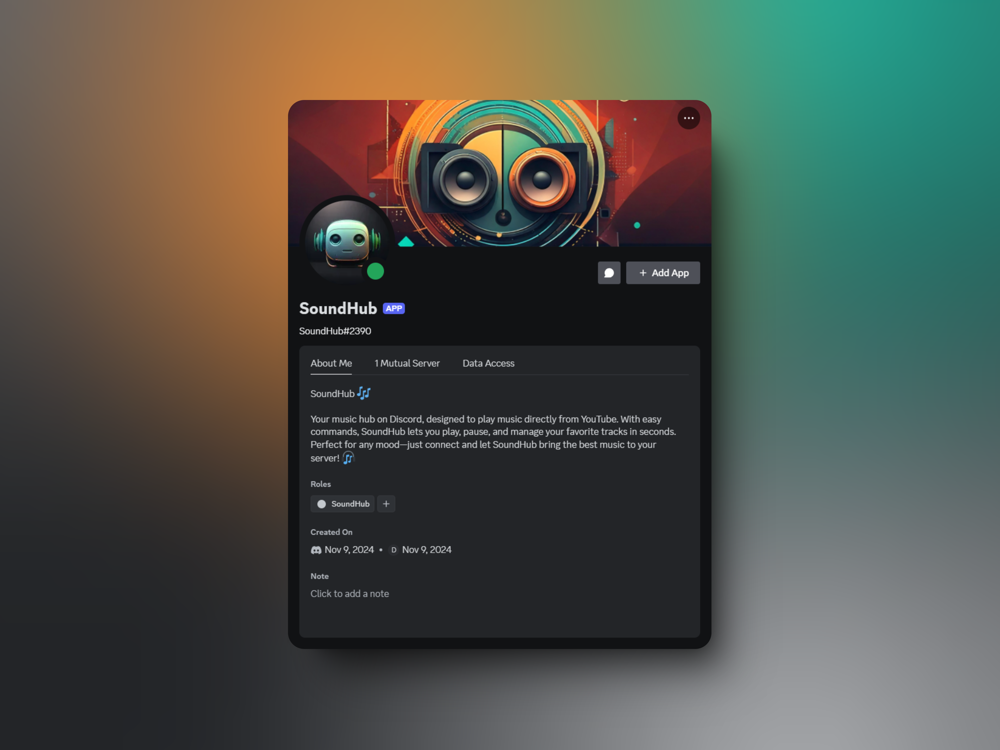

# SoundHub 🎵
> A powerful Discord music bot built with discord.js and discord-player.




## ✨ Features

- 🎵 High-quality audio playback: Supports high-quality audio streaming from various sources such as YouTube, SoundCloud, Twitch, Spotify, or others.
- 📋 Queue management system: Allows you to easily manage and organize the playback queue for smooth song transitions.
- ⏯️ Rich playback controls: Includes comprehensive controls such as play, pause, skip, volume adjustment, and more.
- 🎨 Beautiful embeds: Displays rich and user-friendly information about the track in a clean and visually appealing way.
- ⚡ Fast and responsive: Provides quick response times and efficient audio streaming without delays or lag.
- 🔐 Permission handling: Manages access and permission settings for users, ensuring that only authorized users can control the playback.
- ☁ Only Lavalink v4.0.0 and above are supported, v3 is not supported.


## 🎮 Commands

| Command    | Description        |
|------------|--------------------|
| `/play`    | Play a song        |
| `/pause`   | Pause track        |
| `/resume`  | Resume playback    |
| `/stop`    | Stop playing       |
| `/skip`    | Skip track         |
| `/queue`   | View queue         |
| `/leave`   | Leave Channel         |
| `/loop`   | Repeat Song         |

## 🚀 Setup

### Discord Bot Setup
1. Go to [Discord Developer Portal](https://discord.com/developers/applications)
2. Click "New Application" and give it a name
3. Go to the "Bot" tab and click "Add Bot"
4. Copy the bot token (you'll need this for the `.env` file)
5. Under "Privileged Gateway Intents", enable:
   - Server Members Intent
   - Message Content Intent
   - Voice State Intent
6. Go to "OAuth2" → "URL Generator"
   - Select "bot" and "applications.commands" scopes
   - Select required permissions:
     - Send Messages
     - Connect
     - Speak
     - Use Voice Activity
     - Use Slash Commands
7. Copy the generated URL and use it to invite the bot to your server

### ⚡ Requirements

#### Important Version Notice ⚠️
- Node.js v18.x.x (Required)
  - The bot is NOT compatible with Node.js v20+
  - Recommended version: Node.js 18.19.0 LTS
- Discord Bot Token
- Discord Server

### Installation

```bash
# Check your Node.js version first
node --version # Should show v18.x.x

# If needed, install Node.js v18 from:
# https://nodejs.org/download/release/v18.19.0/

# Alternatively, use nvm (Node Version Manager) to install Node.js v18:
nvm install 18
nvm use 18
```

### Bot Installation
```bash
# Clone the repository
git clone https://github.com/Obskurath/soundhub.git
cd soundhub

# Install dependencies
npm install
```

### Configuration
Create a `.env` file:
```bash
DISCORD_TOKEN=your_bot_token
CLIENT_ID=your_client_id
GUILD_ID=your_server_id
```

### Start
```bash
node index.js
```

## 🛠️ Tech Stack
- discord.js v14
- Node.js v18+
- lavalink-client v2.4.1

## 🤝 Contributing
1. Fork repository
2. Create branch (`git checkout -b feature/amazing-feature`)
3. Commit changes (`git commit -m 'Add feature'`)
4. Push branch (`git push origin feature/amazing-feature`)
5. Open Pull Request

## 📝 License
This project is open-source and available under the [MIT License](LICENSE).
## 💬 Support
Open an issue
